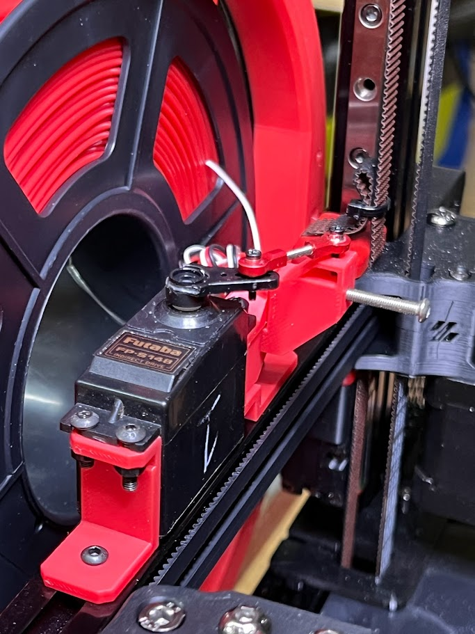

# cutfinger
Servo extended Finger to push cutter blade on 3d printer head.

Specifically I made this to work with the filametrix toolhead cutter mod - https://github.com/juliusjj25/Filametrix 

This is a simple replacement for the fixed cutting assembly that doesn't permanantly take up bed area.

NOTE: Klipper code is in progress...

